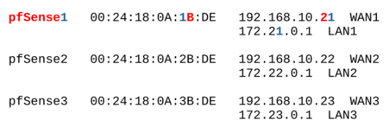

## **STEUERUNGSRECHNER:**

Es handelt sich im folgenden um ein Beispielsetup. Die Verteilung der IPs und MACs ist natürlich veränderbar.

```bash
echo "Host r1
  HostName 192.168.10.11
  User root

Host u1
  HostName 192.168.10.11
  User user

Host dhcp1
  HostName 192.168.10.31
  User user

Host r2
  HostName 192.168.10.12
  User root

Host u2
  HostName 192.168.10.12
  User user

Host dhcp2
  HostName 192.168.10.32
  User user

Host r3
  HostName 192.168.10.13
  User root

Host u3
HostName 192.168.10.13
User user

Host dhcp3
  HostName 192.168.10.33
  User user" >> /home/<tchangalo>/.ssh/config
```
```bash
echo "alias ipbc='ip -br -c a'
alias r1='ssh r1'
alias u1='ssh u1'
alias dhcp1='ssh dhcp1'
alias r2='ssh r2'
alias u2='ssh u2'
alias dhcp2='ssh dhcp2'
alias r3='ssh r3'
alias u3='ssh u3'
alias dhcp3='ssh dhcp3'" >> /home/<tchangalo>/.bashrc
```
Aktivieren mit: 
```bash
. ~/.bashrc
```

## **PVE INSTALLIEREN**

Bei ```ext4``` Swap ausschalten:

```swapoff -a```

```nano /etc/fstab``` ==>

```#/dev/pve/swap none swap sw 0 0```

Updaten: Enterpise Repositories disabeln, No-Subscription Repository adden, Refresh, Upgrade, Reboot.

SSH-Key des Steuerungsrechners unter ```/home/root/.ssh/authorized_keys``` abspeichern:
```bash
ssh-copy-id root@rX
```

```bash
apt install -y sudo mc bpytop htop termshark lnav python3 python3.11 python3-pip python3.11-venv python3-venv sshpass
```

ubuntu-live-server.iso und pfSense.iso hochladen.

vmbr1001 MGMT erstellen. Die IP von vmbr1001 ist 10.20.30.254/24

Später werden folgende weitere IPs im MGMT-Netz vergeben:
```
dhcp1 10.20.30.251
dhcp2 10.20.30.252
dhcp3 10.20.30.253
```

```vmbrX``` LANX erstellen. VLAN-aware, ohne IP. Bei Standalone PVE: ```vmbr1```, ```vmbr2``` und ```vmbr3```.

## **USER UND .VENV ANLEGEN**

scp useradd.sh rX:

**pve-root**: 
```bash
./useradd.sh
```

**Steuerungsrechner**: 
```bash
ssh-copy-id user@uX
```

## **TEILAUTOMATISIERTES SETUP**

Wer die folgenden Schritte des Aufsetzens der pfSense und des DHCP-Servers bereits einmal gemacht hat und Backups dieser Machinen gemacht hat, kann diese Backups nun einfach restoren. Die Backups sollten natürlich nicht uralt sein.

Beim _**Restore der pfSense**_ ist darauf zu achten, dass alle Bridges vorhanden sind, die auch auf dem Rechner vorhanden waren, auf dem das Backup erstellt wurde (also LANX bei _einem_ Clusterknoten bzw. LAN1 - LAN3 bei einem Standalone Server). Für jedes Interface der pfSense muss diejenige Bridge verfügbar sein, die ihm hardwaremäßig zugewiesen ist. Nötigenfalls anpassen.

Nach dem _**Restore des DHCP-Servers**_ müssen die ssh-pubkeys zwischen dem DHCP-Server und dem PVE erneut ausgetauscht werden.

## **INTERNET CREATOR STARTEN**

Nach dem Clonen dieses Repos den Ordner ```ìnc``` aus dem Ordner ```internet_creator_<latest>``` herausnehmen und in den Pfad ```/home/user/``` des PVE-Hosts ablegen und dann von da aus arbeiten. Außerdem auch die Datei ```go.sh``` dort ablegen.

Der Ordner ```ansible``` darf nicht world-writable sein, also z.B. ```770```.

### Optional: Secret Key erstellen

Die Datei ```generate_secret_key.py``` in VSCode ausführen (Python Extension installieren, wenn nicht schon vorhanden) und den Secret Key in Zeile 11 von ```inc.py``` einfügen, z.B:
```bash
11 app.secret\_key = '\x0c\xf6\xb0\x00\x80%\xf0\xaf\x13\xec\xe0\xc6R\x90\xeeh\xb1\xfe\x95\x93\x92\x7f\xaa\xa3'
```

Und dann eingeben:
```bash
source .venv/bin/activate
cd inc
python inc.py
```

Oder ```./go.sh``` unter ```/home/user/``` ausführen - noch einfacher mit ```alias go='./go.sh'``` in der .bashrc

Jetzt kann der Internet Creator im Browser aufgerufen werden unter: ```<pve-ip>:21100```

## PFSENSE AUFSETZEN

Falls möglich als erstes über die MAC Adresse (z.B. unter Network Device -> MAC Address) im Router eine feste IP für die pfSense reservieren: Hier: 192.168.10.21 für pfSense1, 192.168.10.22 für pfSense2 und 192.168.10.23 für pfSense3.

### **1. pfSense VM erstellen**

Das Eingabefeld _Create pfSense_ ausfüllen und Return drücken. Damit wird eine pfSense-VM erstellt und gestartet mit 2 CPUs, 1536 MB RAM und 8 GB Festplatte.

### **2. pfSense installieren**

Statt Auto (ZFS) nehmen wir Auto (UFS) und dann GPT statt MBR.

Swap rauslöschen, um die SSD nicht kaputt zu machen!

Am Ende nicht 'Reboot' wählen, sondern 'Shell' und dann ```poweroff``` eingeben.

### **3. pfSense Postinstall**

Knoten-Nummer in das Feld _pfSense  Postinstall_ eingeben und Return drücken.

### **4. pfSense konfigurieren**

Default Login: 
```
user: admin 
password: pfsense
```

Unter ```System / Advanced / Networking``` 'Kea DHCP' auswählen.

Unter den WAN Firewall Regeln die Anti-Lockout Regel replizieren mit 
```
Protocol: any
Destination: WAN address
```

pfSense runterfahren.

Unter PVE die VLAN-sensiblen Anschlüsse vmbr1, vmbr2 und/oder vmbr3 – ohne irgendwelche IPs – anlegen.

**Beispielsetup:**



Der pfSense einen neuen Network Device auf der vmbr1 mit VLAN-Tag 1011 hinzufügen. Dabei VirtIO (paravirtualised) auswählen und den Haken von Firewall wegnehmen. Das ist das LAN1. Nach dem Hochfahren der pfSense dieses Device mit der IP 172.21.0.1/24 konfigurieren. Die DHCP-Server Range muss nicht besonders groß sein, z.B. 172.21.0.10 bis 172.21.0.20 . Vor dem Hochfahren ggf. (je nach dem, ob man nur einen oder alle drei Provider auf dem PVE aufsetzen möchte) noch zusätzlich vmbr2 und vmbr3 anlegen und dabei ebenfalls VirtIO (paravirtualised) auswählen und den Haken von Firewall wegnehmen.

vmbr2 wird in der pfSense zu LAN2 und bekommt die IP 172.22.0.1/24 und den VLAN-Tag 2011. vmbr3 wird in der pfSense zu LAN3 und bekommt die IP 172.23.0.1/24 und den VLAN-Tag 3011.

Bei LAN2 und LAN3 auf EINEM Node (Standalone-Setup) die ```Default allow LAN2(3) to any rule``` anlegen:
```
Protocol: any
Source: LAN2(3) subnets
Destination: any
```

**Backup erstellen:** Hier ist die Stelle an der nach dem Aufsetzen der pfSense ein Backup erstellt werden kann.

## **UBUNTU DHCP-SERVER AUFSETZEN**

Bevor es losgeht, über die MAC im Router eine feste IP 192.168.10.31\[2,3] für den DHCP-Server reservieren bzw. falls das nicht geht, während der Installation manuell (statisch) für das Interface ```net0``` festlegen.

**Beispielsetup:**


Dem MGMT-Interface ```net1``` während der Installation manuell die IP 10.20.30.251\[2,3]/24 für node1\[2,3] zuweisen.

### **1. DHCP Server VM erstellen**

Das Eingabefeld _Create DHCP Server_ ausfüllen und Return drücken. Damit wird eine VM erstellt und gestartet mit 1536 MB RAM, 4 Cores (host) und 8 GB Festplatte.

### **2. DHCP Server installieren**
Im Beispielsetup während der Installation als Usernamen ```user``` und den Hostnamen ```dhcpX``` wählen. Diese Bezeichnungen sind zwar grundsätzlich frei wählbar, erfordern dann aber ggf. entsprechende Anpassungen in den ```.ssh/config``` und ```.bashrc``` .

Nach dem Installieren: Kein Reboot, kein Shutdown, sondern ```Stop``` und dann: 

### **3. DHCP Server Postinstall und Konfiguration**

Das Eingabefeld _DHCP Server Postinstall and Configuration_ ausfüllen und Return drücken. Dabei sind vier Eingaben zu machen:

```Are you sure you want to continue connecting (yes/no/\[fingerprint])?``` ```yes```

```user@192.168.10.3X's password:```

```user@192.168.10.3X's password:```

Bei der Installation des Kea-Servers werden drei Optionen bzgl. Passwortsetzung für den Server gegeben. Welche man wählt ist für die Funktionalität der Internet Creators irrelevant. Ich nehme immer ```1. Do nothing```, d.h. ```1``` eingeben.

Falls wenig RAM vorhanden: Ausschalten und RAM auf 1024 MB runtersetzen.

**Backup erstellen:** Hier ist die Stelle an der nach dem Aufsetzen des DHCP-Severs ein Backup erstellt werden kann.

## VyOS Setup

### **1. SEED.ISO ERSTELLEN**

Unter _VyOS Setup_ einfach auf _Create Seed_ klicken.

### **2. VyOS Cloud Init Image erstellen**

Das Eingabefeld _Create VyOS Cloud Init Image_ ausfüllen und Return drücken.

Bei der Erstellung des Vyos Cloud Init Image muss im Terminal ggf. das sudo-Password des PVE-Users eingegeben werden, bevor das Skript durchläuft.
